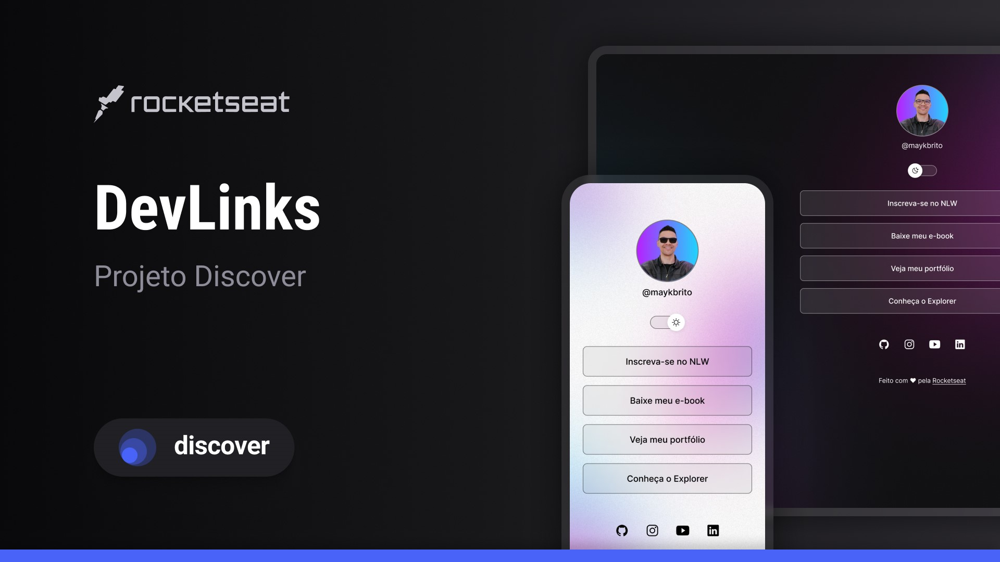

# Daniel Félix | Links Profissionais 🔗

Bem-vindo ao meu cartão de visitas digital! Este projeto é um agregador de links centralizado, construído para ser o ponto de partida para minhas redes profissionais e portfólios.

 

  

## 📍 Veja a Página Ao Vivo

Acesse a versão final e funcional do meu cartão de visitas digital no link abaixo:

**[➡️ Meus Links - Daniel Félix](https://danfelixx11.github.io/danfelix-links/)**

## ✨ Sobre o Projeto

Este é um projeto pessoal criado a partir do curso **"Discover" da Rocketseat**. A base foi o projeto "DevLinks", que personalizei com meu próprio conteúdo, estilo e links, transformando-o em minha identidade digital.

### Funcionalidades Implementadas:
* **Lista de Links Personalizada:** Direciona para meus principais perfis, como LinkedIn e GitHub.
* **Light/Dark Mode:** Um interruptor interativo que altera o tema da página, utilizando variáveis CSS e JavaScript para a lógica.
* **Design Responsivo:** A interface se adapta para uma boa experiência em desktops e celulares.

## 🛠️ Tecnologias Utilizadas

* **HTML5:** Para a estrutura semântica da página.
* **CSS3:** Para a estilização, incluindo Flexbox para layout, variáveis para o sistema de temas e animações.
* **JavaScript:** Para a funcionalidade de troca de tema e manipulação do DOM.
* **Git/GitHub:** Para versionamento e para o deploy da página via GitHub Pages.

## 📫 Conecte-se Comigo

* **LinkedIn:** [Daniel Félix de Oliveira](https://www.linkedin.com/in/danfelix-dev/)
* **Instagram Dev:** [@danfelix.dev](https://www.instagram.com/danfelix.dev/)
* **GitHub Principal:** [@danfelixx11](https://github.com/danfelixx11)
* **Canal do YouTube:** [@danfelix-dev](https://www.youtube.com/@danfelix-dev)